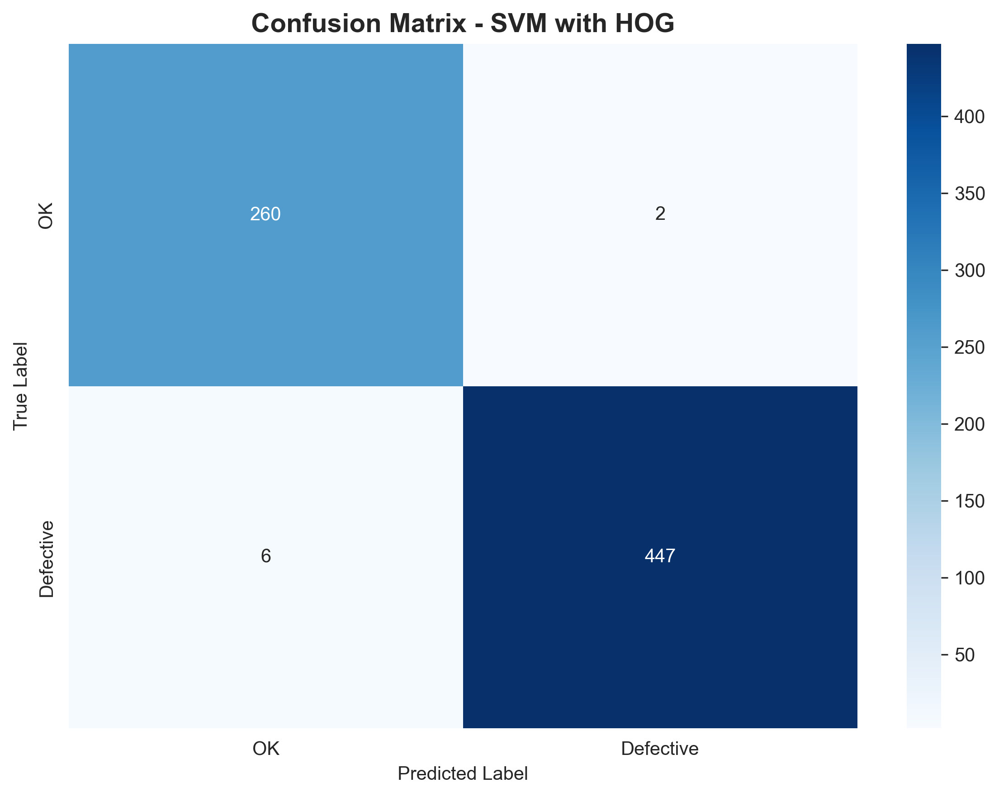
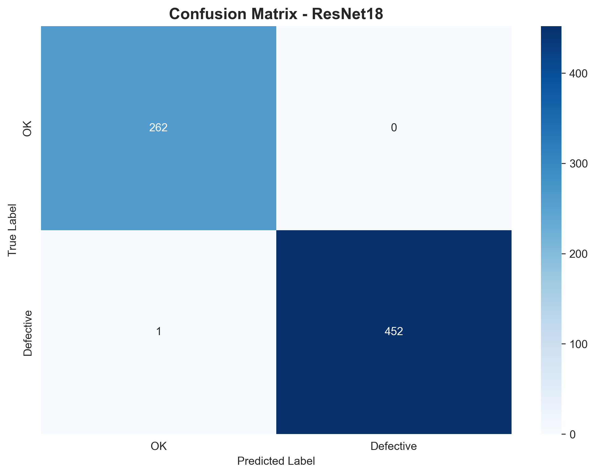
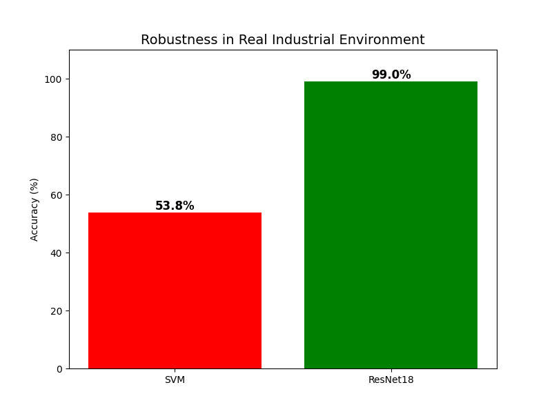

# Quality Control Project

**Automatic Quality Control** system for metallic component inspection with ML and Deep Learning.

## Objective

Manufacturing companies need to inspect thousands of metallic casting components daily. Manual inspection is slow, expensive, and prone to human error. **Can AI do better?**

## Methodology

I used a dataset of metallic casting components from Kaggle to train and test 3 different models:

1. **SVM**
2. **SVM with HOG**
3. **ResNet18**

The first two models are based on classical machine learning, while the third one is based on deep learning.

The goal is to compare the performance of the three models on the test set.

## The 4 Notebooks

The project is structured into 4 notebooks that guide the user from a baseline model to a final robustness comparison.

1.  **`00_svm.ipynb`**: Simple SVM baseline based on raw pixels.
2.  **`01_svm_withHog.ipynb`**: Improved version with **HOG** feature extraction.
3.  **`02_resnet18_training.ipynb`**: **Deep Learning** approach with a pre-trained ResNet18.
4.  **`03_svm_vs_resnet.ipynb`**: **Final stress test** comparing SVM and ResNet on altered images to simulate real conditions.

## Quick Start

### 1. Activate Environment
```bash
venv\\Scripts\\activate.bat
```

### 2. Open the First Notebook
1. Open `notebooks/00_svm.ipynb` in VS Code.
2. Select the **venv** kernel (top right).
3. Run cells with **Shift+Enter**.

### 3. Continue with the Others
Run the notebooks in numerical order to follow the project's logical flow.

## Structure

```
Progetto_Quality_Control/
├── data/raw/              # Download from Kaggle
│   ├── train/ok/
│   ├── train/def_front/
│   ├── test/ok/
│   └── test/def_front/
├── notebooks/             
│   ├── 00_svm.ipynb
│   ├── 01_svm_withHog.ipynb
│   ├── 02_resnet18_training.ipynb
│   └── 03_svm_vs_resnet.ipynb
├── results/               # Automatic output
├── requirements.txt
└── README.md
```

## Dataset

**Casting Product Image Data** (Kaggle):
- https://www.kaggle.com/datasets/ravirajsinh45/real-life-industrial-dataset-of-casting-product
- 6,600 train + 700 test images
- 300×300 grayscale
- 2 classes: `ok` / `defective`


## Results

| Model | Accuracy| Notes |
|---|---|---|
| SVM | ~97% | Surprisingly simple baseline based on raw pixels works very well. |
| SVM with HOG | ~98% | Improved version with **HOG** feature extraction. |
| ResNet18 | ~99% | Deep Learning approach with a pre-trained ResNet18. |

This table shows the accuracy of the models on the test set. We can see that, in the ideal conditions as the perfect positioning of the objects (in the center of the image) and the clear light conditions, the accuracy is around 97%, 98% and 99% for the SVM, SVM with HOG and ResNet18 models, respectively. So you can think that using **ResNet18** could be a lost of resources. The main porpose of the next step is to demonstrate the robustness of a Deep Learning model (As ResNet18) in the real world conditions.

| **SVM with HOG confusion matrix** | **ResNet18 confusion matrix** |
| :---: | :---: |
|  |  |


## Results: The Stress Test

The `03_svm_vs_resnet.ipynb` notebook demonstrates why Deep Learning is superior in an industrial context. Models are tested on "stressed" images (rotated, shifted, with altered brightness).

| **Stress Test Comparison: SVM vs ResNet18** |
| :---: |
|  |


The **ResNet18 maintains nearly perfect performance**, while the SVM degrades drastically, demonstrating it's not robust enough for real-world variations.

# Conclusion:
In a real industrial context, you will never get perfect images. You will have to deal with rotations, shifts, altered brightness, and other variations. In this case, it is clear that a Machine Learning model is not the best choice for this specific task. Instead, as proof of concept, a Deep Learning model, as ResNet18, could be the best choice.

## 🛠️ Troubleshooting

**GPU not working?**
```bash
python -c "import torch_directml; print(torch_directml.device())"
```

**Out of memory?**  
Reduce `BATCH_SIZE` from 32 → 16 in the notebook

**Missing dependencies?**
```bash
pip install -r requirements.txt
```

---

**Ready** Open the notebooks and start 
